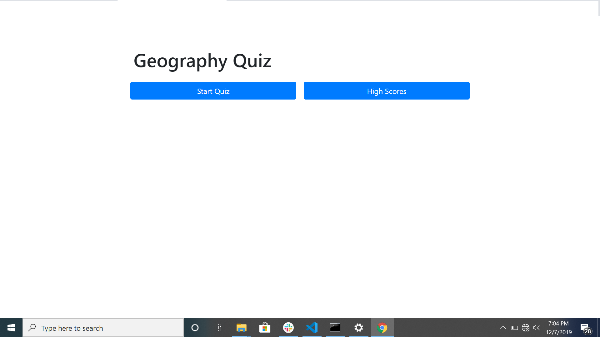
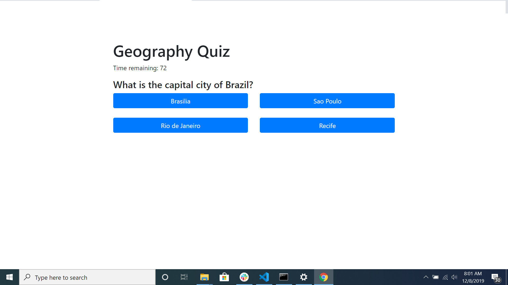
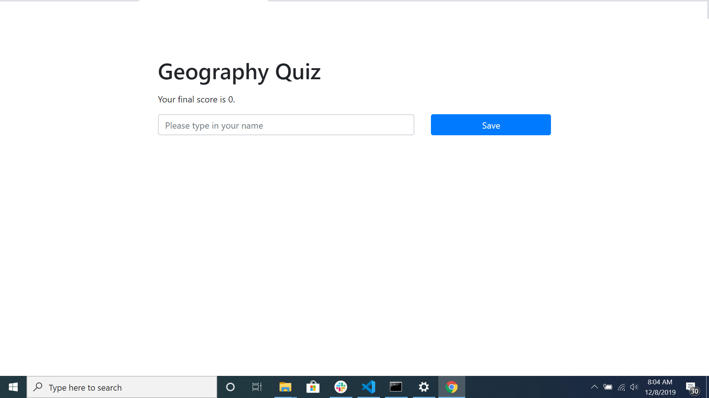

# Code Quiz
This is my Trivia Game or i like to call it Geography quiz, it has five questions and each question contain 4 mutiple choice answers.  

# Prerequisites
No prerequistes 

# Installing
Copy files and open with browser
check code with VS or inspect using the browser

# Built With
Bootstrap 
Java 
HTML
Github pages

# Authors
Marwan Jassim

# License
This project is licensed under the MIT License
https://github.com/marwanjassim/password-generator.git